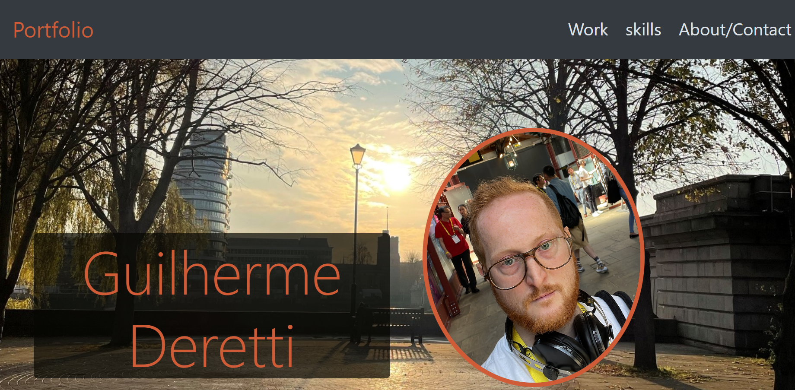
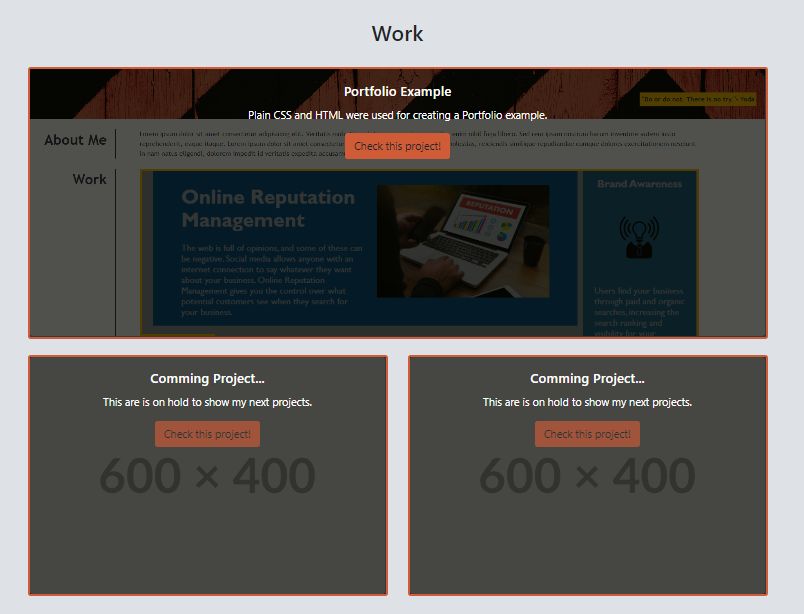
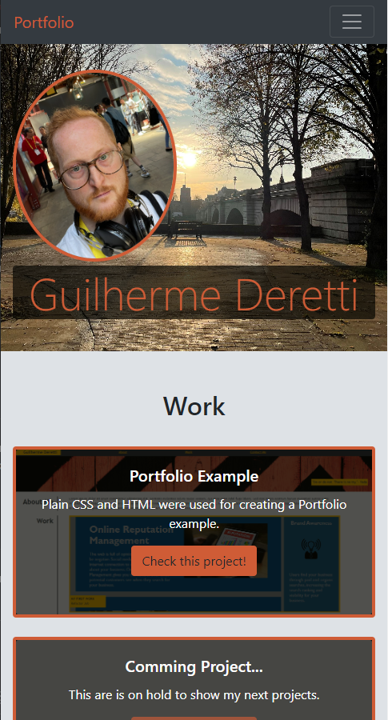

# Bootstrap-Portfolio

## Description

This website was created with the objective of having a professional portfolio as for my carrer in web development to show the projects i've done and participate to future employers.
Different from my last portfolio project with plain CSS an HTML, in this one we apply Bootstrap, a way to build our website with documented modules which fasten the process. Reading the documentation to understend how it works might spend some time, but after done, makes new projects ezier to prebuild.

**Note:** This project is still under development and will receive updates from time to time, including addition of new projects to showcase.

## instalation

N/A

## Usage

* In the top of the website you'll find links to the sections, when clicked it will scrolls to the corresponding section.

* Next section you'l find a picture with my name as a professional presentation.

* In the section work you can find my projects with title, description and images, by clicking in buttom you'll be redirected to the specific deployed project.

* This website is responsive and you can test by opening it in your computer, mobile phone or tablet and you will see that it's responsive to your screen size.

## Credits

[Victor Biscio](https://github.com/reinkaoss)

## License

Available under the MIT license. See the LICENSE file for more info.

## Test

[Deployed application](https://guilhermederetti.github.io/Bootstrap-Portfolio/)